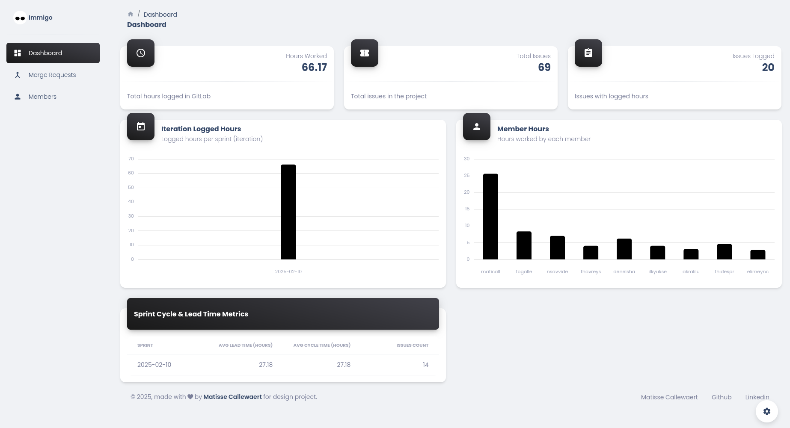
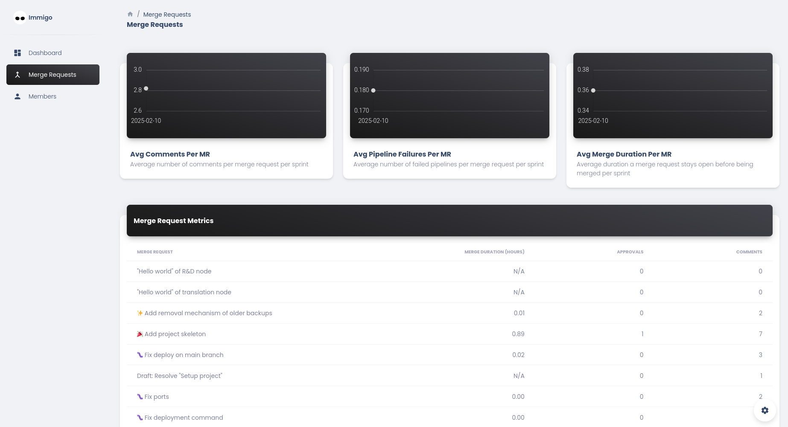
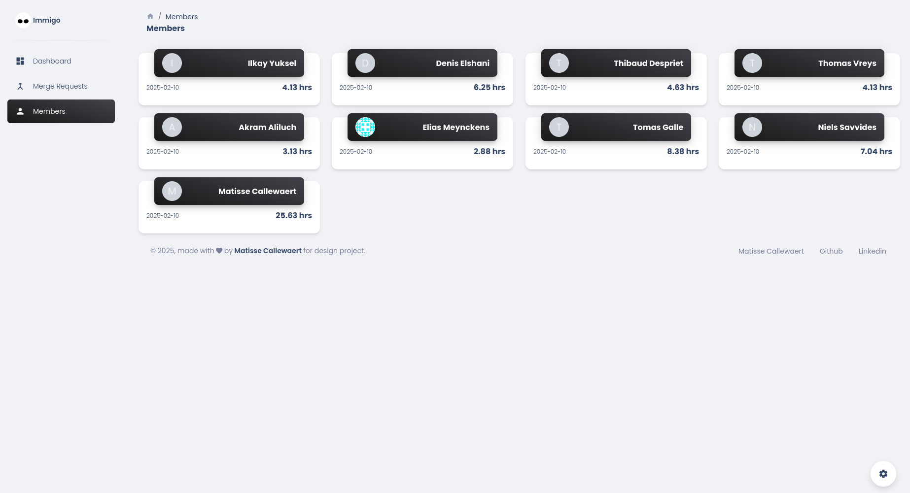

# Project Management Dashboard
This is a dashboard made especially for design project. It shows information about the members, the merge requests, total hours worked, total issues and so on. It is a simple dashboard that can be used to show the progress of the project.

When you want to use it, set the values in the `.env-example` file to the ones of your project and then rename it to `.env`. After that, you can run the dashboard using `npm run start`. If you want to deploy it, you can use `npm run build` and then deploy the `build` folder.

Here some screenshots of the dashboard:

